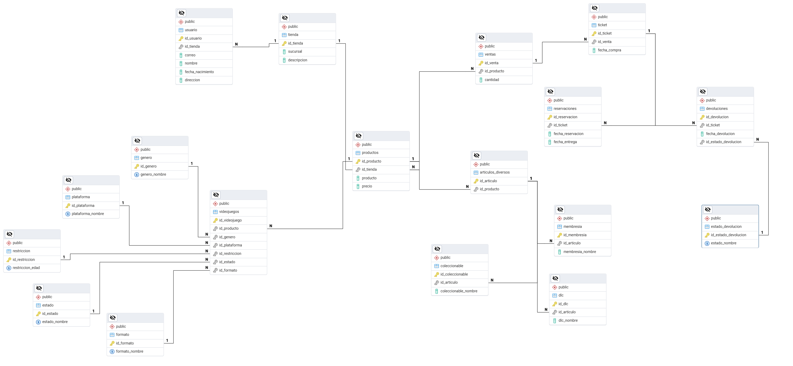

# Gestion-Proyectos-ISC
"Sistema de gestión y seguimiento de proyectos académicos y personales desarrollado en SQL para medir el crecimiento técnico en la carrera de I.S.C."

## Diagramas del Proyecto
### Modelo Entidad-Relación

### Modelo Relacional Normalizado

